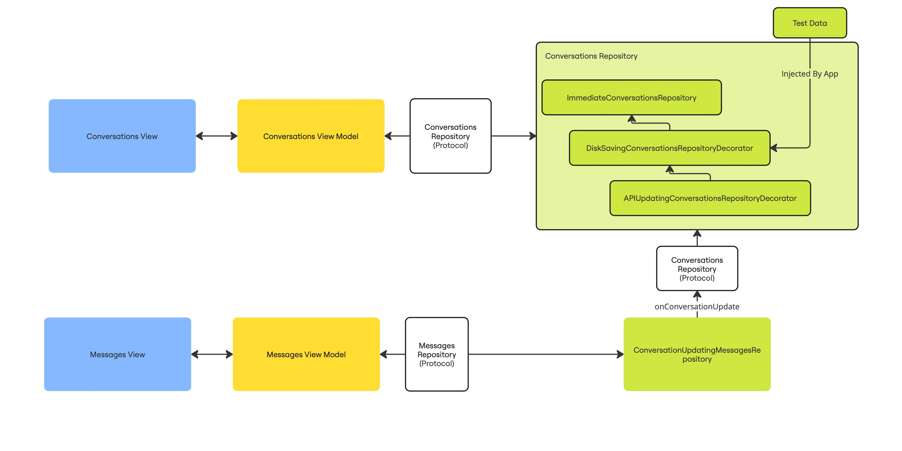

# MichaelBaldock-Blink-iOS-Code-Test
A Take Home Assignment for a coding test as part of Blink job application process

Requirements: https://joinblink.notion.site/iOS-Code-Test-35bd49afbf954e8b805794641a594e34

# Summary Of Solution

## Views
* I have used SwiftUI as my View layer.
* 2 views: ConversationsView and MessagesView
## Domain
* I use View Models to publish state to my views and prepare domain data for the View.
* The View Model is responsible for subscribing to the published data from the repository and performing any data manipulations required to render the data to the view (such as sorting)
## Data
* I use a Repository layer facade (protocol) to provide an interface for my viewModels to update the data and subscribe to updates from the repository
* The Repository layer exposes a Combine Publisher.
  * Note: The choice of using Combine Publisher to propagate state from Data -> View Models was driven by the type of app in the requirements which is a chat app. Often a chat app will require an inherently reactive data model so that messages from multiple clients are propagated efficiently. Eg WebSockets are often used as the network transport layer.
* Within the Repository layer I have used a Decorator pattern to compose different side-effects:
  * The Conversations Repository is implemented by 3 classes that are each wrapped to form a decorator chain. They are:
    * ImmediateConversationsRepository
    * DiskSavingConversationsRepositoryDecorator
    * APIUpdatingConversationsRepositoryDecorator
## Navigation
* I have used the iOS 16 NavigationStack(path:) with .navigationDestination(for:) view modifier to perform navigation.
* I have built the functionality to perform the navigation using:
  * Router - Interface for views to use, can be added to Environment if needed
  * Routes (enum) - To encapsulate view data requirements
  * SwiftUIRouteViewBuilder - to return the view, injecting the dependencies required by the view model
## Dependencies
* I have made a simple RepositoriesFactory to manage the dependencies required by the view models.
* I inject a closure to the view builder that is implemented using the factory to return the dependency required
  * Note: When you add a message in the Messages view, I wanted to implement a mechanism to update the Conversations (root) view. So there is a requirement to have a single conversations repository that is shared with messages.

# Ran out of time to do
* I have only done a few unit tests covering an example of how to test in different layers. More test coverage would be needed for production code
* Some refactoring of the testing functionality would be needed to work easily with the combine publisher implementations
* As instructed on the requirements, I have not done any work making the UI look and feel like a Chat App, instead I focussed on the separation of concerns in the architecture.
* Since I haven't worked on the UI, I haven't setup XCode previews, some view refactoring would be needed to easily generate previews of the views
* I wanted to have a demo publishing of new messages to the messages view to make use of the reactive data stack, but ran out of time.
